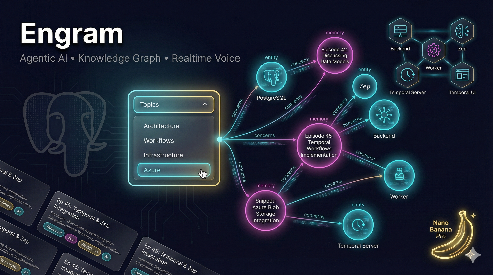

# 🧠 Engram: The Agentic AI System with "Nano Banana" Power

We've been hard at work building **Engram**, a truly agentic AI system that pushes the boundaries of context and memory. Here's a deep dive into what we've implemented and why it's exciting. 🚀

---

## 🏗️ The Architecture: Robust & Scalable

Engram runs on **Azure Container Apps** with **5 distinct services**:

| Service | Role |
|---------|------|
| **Backend API** | Central nervous system |
| **Worker** | Async task processing |
| **Zep Memory** | The hippocampus (memory layer) |
| **Temporal Server** | Durable workflow orchestration |
| **Temporal UI** | Workflow monitoring |

All backed by **PostgreSQL** with `pgvector` for embeddings.

---

## ⚡️ The Topics Dropdown: Deep Dive

The **Topics dropdown** on the **Episodes** screen is where it gets interesting:

- **Frontend**: Dynamically extracts unique topics from all episodes
- **Backend**: Pulls topics from Zep session metadata
- **Ingestion**: Auto-extracts topics via keyword mapping (e.g., "temporal" → "Workflows")
- **Knowledge Graph**: Topics become graph nodes, linked to Episodes via "concerns" edges

---

## 🍌 Nano Banana Pro & Visual Storytelling

Our **visual storytelling agent (Sage)** can autonomously:

1. Write a narrative story based on context
2. Generate a supporting image via **Nano Banana 🍌 Pro** (Gemini 3's `gemini-3-pro-image-preview`)
3. Store the image persistently on **Azure Files**

This end-to-end pipeline means Sage doesn't just *tell* stories—it *illustrates* them.

---

# AI #AgenticAI #Engram #Azure #Postgres #Gemini3 #NanoBanana #KnowledgeGraph #VectorDB #BuildPublic
