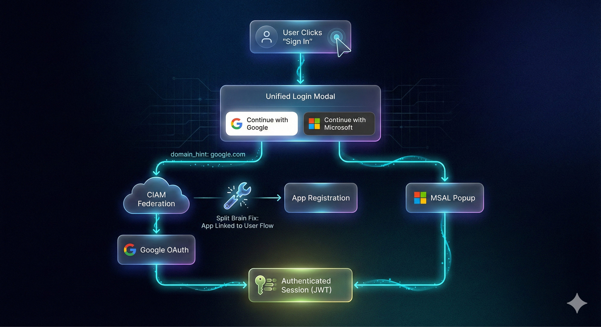

# 🔐 Unified Login & The "Split Brain" Fix

We successfully overhauled the Engram authentication experience, unifying disparate login options into a premium glassmorphic modal and resolving a critical infrastructure configuration mismatch.

---

## 🛠️ The Challenge: "Split Brain" Configuration

During implementation, we encountered a persistent issue where the Google Login option was missing from the Azure Entra External ID (CIAM) popup, despite appearing correctly configured in the Azure Portal.

**Root Cause:**
We discovered a **Tenant Mismatch**:

- **Infrastructure**: Our Bicep templates were deploying our Container Apps using an App Registration (`94d5...`) located in the **Corporate Tenant** (ZimaxNet).
- **Identity**: Our User Flows were configured in the separate **CIAM Tenant** (EngramAI).

CIAM User Flows cannot be linked to applications outside their own tenant. This created a "split brain" where our code pointed to the right User Flow but the wrong Application ID, causing the flow to ignore our Federation settings.

## ✅ The Solution

1. **Unified Authentication Modal**:
    - Replaced cluttered buttons with a sleek, centered modal.
    - Implemented `domain_hint: 'google.com'` to auto-direct users to the correct federated Identity Provider, skipping the confusing "Home Realm Discovery" screen.

2. **Configuration Synchronization**:
    - Created a new App Registration (`e32c...`) natively within the **CIAM Tenant**.
    - Updated **Infrastructure** (`parameters.json`), **GitHub Secrets**, and **Local Environment** (`.env`) to use this single source of truth.
    - Successfully deployed a "Config Only" hot-patch to Azure Container Apps.

## 🧠 Memory Enrichment

We have generated a detailed JSON artifact capturing this architectural flow for Sage (our storytelling agent) to reference:

- **Artifact**: [auth-user-flow.json](../social/auth-user-flow.json)
- **Diagram**: [engram-user-auth-flow.png](../../diagrams/engram-user-auth-flow.png)

---

# Auth #CIAM #Azure #Engram #DevOps #Identity
