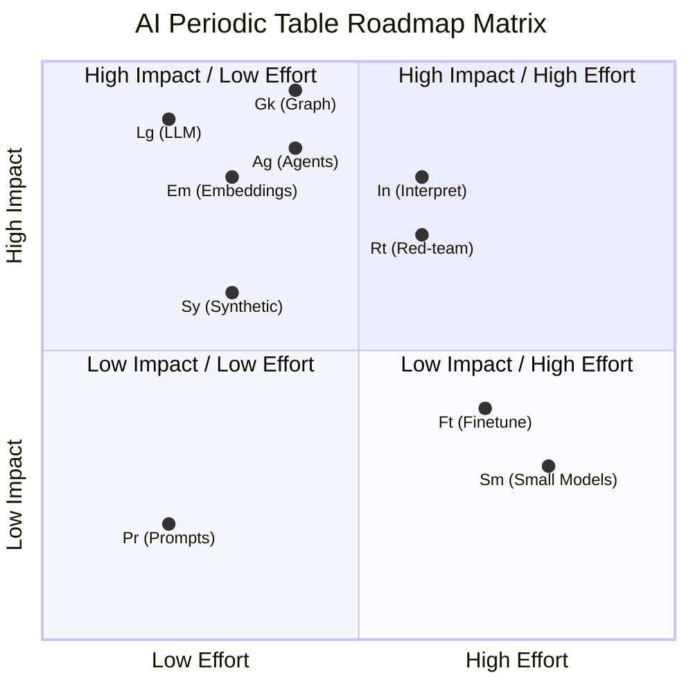

    
        # AI Periodic Table → Engram Architecture Mapping

        
            A comprehensive tree-structure mapping of each AI Periodic Table element to Engram's
                    implementation, with a conceptualized roadmap for future development.
        
        *Baseline: January 5, 2026*

        
            [📊 Interactive Matrix](ai-periodic-table-matrix.html)
            [📋 Business Plan](business-plan-ai-periodic-table.md)
            [📚 Wiki](wiki/ai-periodic-table.md)
        

        

        
## Element Reference

                    Symbol
                    Element
                    Row
                    Status
                    Description
                
            
            
                
                    **Pr**
                    Prompts
                    R1
                    🟢
                    Agent system prompts (Elena, Marcus, Sage)
                
                
                    **Em**
                    Embeddings
                    R1
                    🟢
                    Zep automatic vectorization + Tri-Search
                
                
                    **Lg**
                    LLM
                    R1
                    🟢
                    Claude, Gemini, Azure APIM Model Router
                
                
                    **Fc**
                    Function Call
                    R2
                    🟢
                    20+ tools across agents (GitHub, Graph, memory)
                
                
                    **Vx**
                    Vector
                    R2
                    🟢
                    Zep built-in vector store
                
                
                    **Rg**
                    RAG
                    R2
                    🟢
                    Auto context injection every agent turn
                
                
                    **Gr**
                    Guardrails
                    R2
                    🟢
                    Azure Entra ID, RBAC, tenant isolation
                
                
                    **Mm**
                    Multimodal
                    R2
                    🟢
                    Imagen, VoiceLive, diagram generation
                
                
                    **Ag**
                    Agent
                    R3
                    🟢
                    LangGraph personas with tools + memory
                
                
                    **Ft**
                    Finetune
                    R3
                    🔴
                    Not implemented (roadmap: LoRA, Azure ML)
                
                
                    **Fw**
                    Framework
                    R3
                    🟢
                    Temporal durable workflows
                
                
                    **Rt**
                    Red-team
                    R3
                    🟡
                    Basic validation, Golden Thread
                
                
                    **Sm**
                    Small Models
                    R3
                    🔴
                    Not implemented (roadmap: Phi-4, edge)
                
                
                    **Ma**
                    Multi-agent
                    R4
                    🟢
                    Agent delegation via Temporal
                
                
                    **Sy**
                    Synthetic
                    R4
                    🟢
                    Story + diagram + image pipeline
                
                
                    **Gk**
                    Graph Knowledge
                    R4
                    ⭐
                    Zep temporal knowledge graph (unique!)
                
                
                    **In**
                    Interpret
                    R4
                    🔴
                    Not implemented (roadmap: explainability)
                
                
                    **Th**
                    Thinking
                    R4
                    🟢
                    LangGraph multi-step reasoning
                
            
        

        

        
## Visual Overview

        AI PERIODIC TABLE → ENGRAM ARCHITECTURE
═══════════════════════════════════════════════════════════════════════════════

                        ┌─────────────────────────────────────┐
                        │         ENGRAM PLATFORM             │
                        │   Brain (Zep) + Spine (Temporal)    │
                        └───────────────────┬─────────────────┘
                                            │
        ┌───────────────┬───────────────┬───┴───┬───────────────┬───────────────┐
        │               │               │       │               │               │
   ┌────▼────┐    ┌─────▼─────┐   ┌─────▼─────┐ │  ┌───────────▼───────────┐   │
   │ C1      │    │ C2        │   │ C3        │ │  │ C4                    │   │
   │ Reactive│    │ Retrieval │   │ Orchestr. │ │  │ Validation            │   │
   └────┬────┘    └─────┬─────┘   └─────┬─────┘ │  └───────────┬───────────┘   │
        │               │               │       │              │               │
        ▼               ▼               ▼       ▼              ▼               ▼
   ┌─────────┐    ┌─────────┐    ┌──────────┐ ┌─────────┐ ┌─────────┐    ┌─────────┐
   │Pr Em Fc │    │Vx Ft Sy │    │Rg Fw Gk  │ │Gr Rt In │ │Lg Mm Sm │    │   Th    │
   │Ag Ma    │    │         │    │          │ │         │ │         │    │         │
   └─────────┘    └─────────┘    └──────────┘ └─────────┘ └─────────┘    └─────────┘

## Summary Statistics

                    Status
                    Count
                    Elements
                
            
            
                
                    🟢 Strong
                    12
                    Pr, Em, Lg, Fc, Vx, Rg, Gr, Mm, Ag, Fw, Ma, Sy, Th
                
                
                    🟡 Emerging
                    1
                    Rt
                
                
                    🔴 Gap
                    3
                    Ft, Sm, In
                
                
                    ⭐ Unique
                    1
                    Gk (Knowledge Graph)
                
            
        

        

        
## Element-by-Element Tree Mapping

### 🟢 ROW 1: PRIMITIVES (Foundation Layer)

        R1 PRIMITIVES
├── Pr (Prompts) ──────────────────────────────────── 🟢 STRONG
│   ├── Current Implementation
│   │   ├── backend/agents/elena/agent.py → ElenaAgent.system_prompt
│   │   ├── backend/agents/marcus/agent.py → MarcusAgent.system_prompt
│   │   ├── backend/agents/sage/agent.py → SageAgent.system_prompt
│   │   └── backend/llm/claude_client.py → SAGE_SYSTEM_PROMPT
│   │
│   ├── Key Features
│   │   ├── Context-First Requirements Framework (Elena)
│   │   ├── Calm in the Storm Leadership (Marcus)
│   │   ├── Sage Meridian Storyteller persona
│   │   └── Enterprise context injection via EnterpriseContext.to_llm_context()
│   │
│   └── Roadmap
│       ├── [ ] Prompt versioning and A/B testing
│       ├── [ ] Dynamic prompt composition based on user role
│       └── [ ] Prompt performance analytics dashboard
│
├── Em (Embeddings) ───────────────────────────────── 🟢 STRONG
│   ├── Current Implementation
│   │   ├── Zep Cloud → Automatic embedding on message ingestion
│   │   ├── backend/memory/client.py → search_memory()
│   │   └── backend/etl/ingestion_service.py → Document chunking + embedding
│   │
│   ├── Key Features
│   │   ├── Tri-Search (Keyword + Vector + Graph)
│   │   ├── Automatic entity extraction
│   │   └── Cross-session knowledge compounding
│   │
│   └── Roadmap
│       ├── [ ] Custom embedding models for domain-specific terms
│       ├── [ ] Embedding drift detection
│       └── [ ] Multi-modal embeddings (text + image)
│
└── Lg (LLM) ──────────────────────────────────────── 🟢 STRONG
    ├── Current Implementation
    │   ├── backend/agents/base.py → FoundryChatClient
    │   ├── backend/llm/claude_client.py → ClaudeClient (Anthropic)
    │   ├── backend/llm/gemini_client.py → GeminiClient (Google)
    │   └── Azure APIM Gateway → Model Router pattern
    │
    ├── Key Features
    │   ├── Multi-model orchestration (Claude for text, Gemini for visuals)
    │   ├── Automatic fallback (Anthropic API → Azure APIM)
    │   ├── Model Router for dynamic model selection
    │   └── Token-based authentication (Azure AD + API keys)
    │
    └── Roadmap
        ├── [ ] Cost-aware model routing (use cheaper models for simple tasks)
        ├── [ ] Latency-optimized routing (edge deployment)
        └── [ ] Model performance comparison dashboard

### 🟢 ROW 2: COMPOSITIONS (Integration Layer)

        R2 COMPOSITIONS
├── Fc (Function Call) ────────────────────────────── 🟢 STRONG
│   ├── Current Implementation
│   │   ├── backend/agents/github_tools.py
│   │   │   ├── create_github_issue_tool
│   │   │   ├── update_github_issue_tool
│   │   │   ├── get_project_status_tool
│   │   │   ├── list_my_tasks_tool
│   │   │   └── close_task_tool
│   │   │
│   │   ├── backend/agents/elena/agent.py
│   │   │   ├── search_memory_tool
│   │   │   ├── send_email_tool (Microsoft Graph)
│   │   │   ├── list_onedrive_files_tool
│   │   │   ├── save_to_onedrive_tool
│   │   │   ├── trigger_ingestion_tool
│   │   │   ├── run_golden_thread_tool
│   │   │   ├── analyze_requirements
│   │   │   ├── stakeholder_mapping
│   │   │   ├── create_user_story
│   │   │   └── delegate_to_sage
│   │   │
│   │   ├── backend/agents/marcus/agent.py
│   │   │   ├── create_project_timeline
│   │   │   ├── assess_project_risks
│   │   │   ├── create_status_report
│   │   │   ├── estimate_effort
│   │   │   ├── delegate_to_sage
│   │   │   ├── start_bau_flow_tool
│   │   │   └── check_workflow_status_tool
│   │   │
│   │   └── backend/agents/sage/agent.py
│   │       ├── generate_story
│   │       ├── generate_diagram
│   │       └── generate_visual
│   │
│   └── Roadmap
│       ├── [ ] MCP (Model Context Protocol) server implementation
│       ├── [ ] Tool discovery and dynamic registration
│       └── [ ] Tool execution analytics and cost tracking
│
├── Vx (Vector) ───────────────────────────────────── 🟢 STRONG
│   └── Zep Cloud → Built-in vector store + Tri-Search
│
├── Rg (RAG) ──────────────────────────────────────── 🟢 STRONG
│   └── Automatic context injection in every agent turn
│
├── Gr (Guardrails) ───────────────────────────────── 🟢 STRONG
│   └── Azure Entra ID + RBAC + Tenant isolation
│
└── Mm (Multimodal) ───────────────────────────────── 🟢 STRONG
    ├── Text → Image generation (Gemini/Imagen)
    ├── Voice → Text → Voice (VoiceLive)
    └── Story + Image + Diagram bundling

### 🟡 ROW 3: DEPLOYMENT (Production Layer)

        R3 DEPLOYMENT
├── Ag (Agent) ────────────────────────────────────── 🟢 STRONG
│   ├── Elena (Business Analyst), Marcus (PM), Sage (Storyteller)
│   └── LangGraph StateGraph + Memory-enriched context
│
├── Ft (Finetune) ─────────────────────────────────── 🔴 GAP
│   └── Roadmap: LoRA adapters, Azure AI Fine-tuning
│
├── Fw (Framework) ────────────────────────────────── 🟢 STRONG
│   └── Temporal Server → Durable workflow orchestration
│
├── Rt (Red-team) ─────────────────────────────────── 🟡 EMERGING
│   └── Basic validation, Golden Thread checks
│
└── Sm (Small Models) ─────────────────────────────── 🔴 GAP
    └── Roadmap: Phi-4, Granite, edge deployment

### ⭐ ROW 4: EMERGING (Innovation Layer)

        R4 EMERGING
├── Ma (Multi-agent) ──────────────────────────────── 🟢 STRONG
│   └── Agent-to-agent delegation via Temporal workflows
│
├── Sy (Synthetic) ────────────────────────────────── 🟢 STRONG
│   └── Story + diagram + image generation pipeline
│
├── Gk (Graph Knowledge) ──────────────────────────── ⭐ UNIQUE DIFFERENTIATOR
│   ├── Zep Cloud → Temporal Knowledge Graph
│   ├── Automatic entity/relationship extraction
│   ├── Knowledge compounds across sessions
│   └── WHY UNIQUE: Dynamic context orchestration vs static RAG
│
├── In (Interpret) ────────────────────────────────── 🔴 GAP
│   └── Roadmap: "Why did you say that?", attention viz, source attribution
│
└── Th (Thinking) ─────────────────────────────────── 🟢 STRONG
    └── LangGraph multi-step reasoning + tool-augmented thinking

## Implementation Matrix (Effort vs. Impact)

### Recommendation

- **Quadrant 2 (High Impact, Low Effort)**: Focus on **Embeddings (Em)**, **LLM (Lg)**, and **Synthetic (Sy)** pipelines. (🟢 Completed)
- **Quadrant 1 (High Impact, High Effort)**: The **Graph Knowledge (Gk)** and **Agents (Ag)** layers are the core differentiators. (⭐ In Progress)
- **Quadrant 4 (Low Impact, High Effort)**: **Small Models (Sm)** and **Finetuning (Ft)** should be deferred until strict cost/latency requirements emerge.

## Element-by-Element Tree Mapping

(See full breakdown below)
