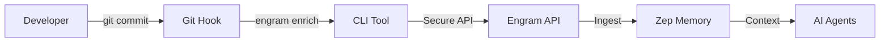

# Enterprise Memory Enrichment

> **"Invisible Enrichment"**: Capturing high-value technical context without disrupting developer flow.

## Overview

Engram automatically ingests context from your development lifecycle to build a comprehensive Knowledge Graph. This ensures that when you ask, *"Why did we change the authentication logic last week?"*, the AI has the answer—even if you never wrote separate documentation.

## How It Works



1. **Capture**: You perform your normal work (`git commit`, `git push`).
2. **Enrich**: A local hook captures the commit message and diff statistics.
3. **Secure**: The CLI authenticates using your existing Azure identity (verified via OID).
4. **Ingest**: Technical context is added to the "Project Memory" layer.

## Setup

One-time setup for developers:

```bash
# 1. Install Hooks
./scripts/setup_hooks.sh

# 2. Login (if not already logged in)
az login
```

That's it. Your commits are now part of the collective intelligence.

## CLI Reference

The `engram` CLI can also be used manually:

```bash
# Push a manual note to memory
python3 scripts/engram_cli.py enrich --message "Deployment to staging failed due to timeout"

# Check status
python3 scripts/engram_cli.py auth
```

## Security

- **No Secrets**: We do not store long-lived tokens on your machine.
- **Identity-Bound**: Every memory is cryptographically signed by your Azure AD identity.
- **Privacy**: Only diff statistics and commit messages are sent by default; code content is excluded unless explicitly configured.
