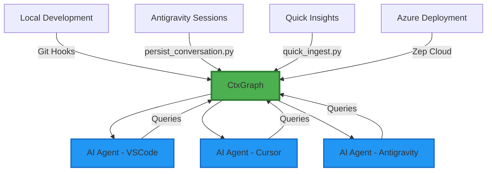

# The Vibe Coding Breakthrough: When AI Memory Transcends Boundaries

*Generated by Sage on January 4, 2026*


## The Moment of Recognition

Picture this: You're deep in a coding session, fingers dancing across the keyboard in that mysterious state developers call "the flow." Your AI assistant, Antigravity, is responding with uncanny precision—not just to your immediate questions, but to the *intent* behind them. It remembers that debugging session from last Tuesday, references the architectural decision you made three commits ago, and somehow *knows* exactly which configuration quirk you're wrestling with.

This isn't magic. This is **emergent contextual awareness**—and today, we cracked the code on making it work everywhere.

## The Architecture of Memory

### The Discovery: Cross-Environment Consciousness

What started as a local development curiosity became something far more profound. The `query_memory.py` script that worked beautifully in our local environment suddenly revealed its true potential when we added a single, elegant parameter:

```bash
python -m backend.scripts.query_memory --env azure -q "voice live config"
```

That simple `--env` flag became a bridge between worlds—local development and cloud deployment, isolated sessions and shared knowledge, individual insight and collective wisdom.

### The CtxGraph: A Digital Synaptic Network



## The Continuous Enrichment Cycle

### 1. The Git Post-Commit Oracle

Every commit becomes a story. Our post-commit hooks don't just track changes—they capture the *narrative* of development:

```python
# Git hook captures commit context
def enrich_from_commit(commit_hash, message, diff):
    context = {
        "event": "code_change",
        "commit": commit_hash,
        "description": message,
        "technical_context": analyze_diff(diff),
        "timestamp": datetime.now(),
        "learning": extract_insights(diff, message)
    }
    memory_graph.ingest(context)
```

### 2. The Quick Insight Capture

Those "aha!" moments that usually vanish like morning mist? Now they persist:

```bash
python quick_ingest.py "The voice API latency issue was caused by WebRTC buffering - need to adjust chunk size to 480 samples"
```

### 3. The Session Artifact Preservation

Every Antigravity conversation becomes institutional memory:

```python
def persist_conversation(session_artifacts):
    """Transform ephemeral dialogue into permanent wisdom"""
    for artifact in session_artifacts:
        enriched_context = {
            "conversation_thread": artifact.thread_id,
            "problem_solved": artifact.problem_statement,
            "solution_path": artifact.solution_steps,
            "code_changes": artifact.code_diff,
            "learning_extracted": artifact.key_insights
        }
        memory_graph.store(enriched_context)
```

## The Enterprise Implications

### Breaking Down Development Silos

> **Key Insight**: Traditional development environments create knowledge islands. The Vibe Coding Breakthrough builds bridges between these islands, creating an archipelago of connected intelligence.

In enterprise environments, knowledge often dies in:

- **Slack threads** that scroll into oblivion
- **Documentation** that becomes outdated the moment it's written
- **Individual developer minds** that leave when people change teams

The CtxGraph transforms this scattered knowledge into a living, queryable repository that grows smarter with every interaction.

### The ROI of Institutional Memory

Consider the typical enterprise scenario:

| Traditional Approach | Vibe Coding Approach |
|---------------------|---------------------|
| Developer spends 2 hours re-discovering a solution | AI instantly recalls: "Sarah fixed this in commit abc123 last month" |
| Team meeting to discuss architecture decisions | CtxGraph provides complete decision history and rationale |
| New team member takes weeks to understand codebase context | AI provides personalized onboarding based on actual project history |

## The Brain Metaphor: From Neurons to Knowledge Networks

### Synaptic Development

Just as human brains strengthen neural pathways through repetition and association, the CtxGraph creates stronger connections between related concepts, problems, and solutions. Each query doesn't just retrieve information—it reinforces the relationships between ideas.

### Episodic vs. Semantic Memory

The system mirrors human memory architecture:

- **Episodic Memory**: Individual sessions, commits, conversations
- **Semantic Memory**: Extracted facts, patterns, and principles

Over time, the episodic becomes semantic—specific debugging sessions become general troubleshooting knowledge.

## Looking Forward

The Vibe Coding Breakthrough represents a fundamental shift in how we think about AI-assisted development. It's not just about having a smarter assistant—it's about creating a development environment that truly *learns* from every interaction, every commit, every moment of insight.

As the CtxGraph grows, so does the collective intelligence of the entire development ecosystem. Each developer's insights become available to all. Each solution discovered becomes ammunition against future problems. Each "aha!" moment is preserved for eternity.

**This is the future of software development: Not just coding, but *remembering*.**

---

*Story ID: story-20260104-222054-the-vibe-coding-breakthrough-cross-environment-mem*
