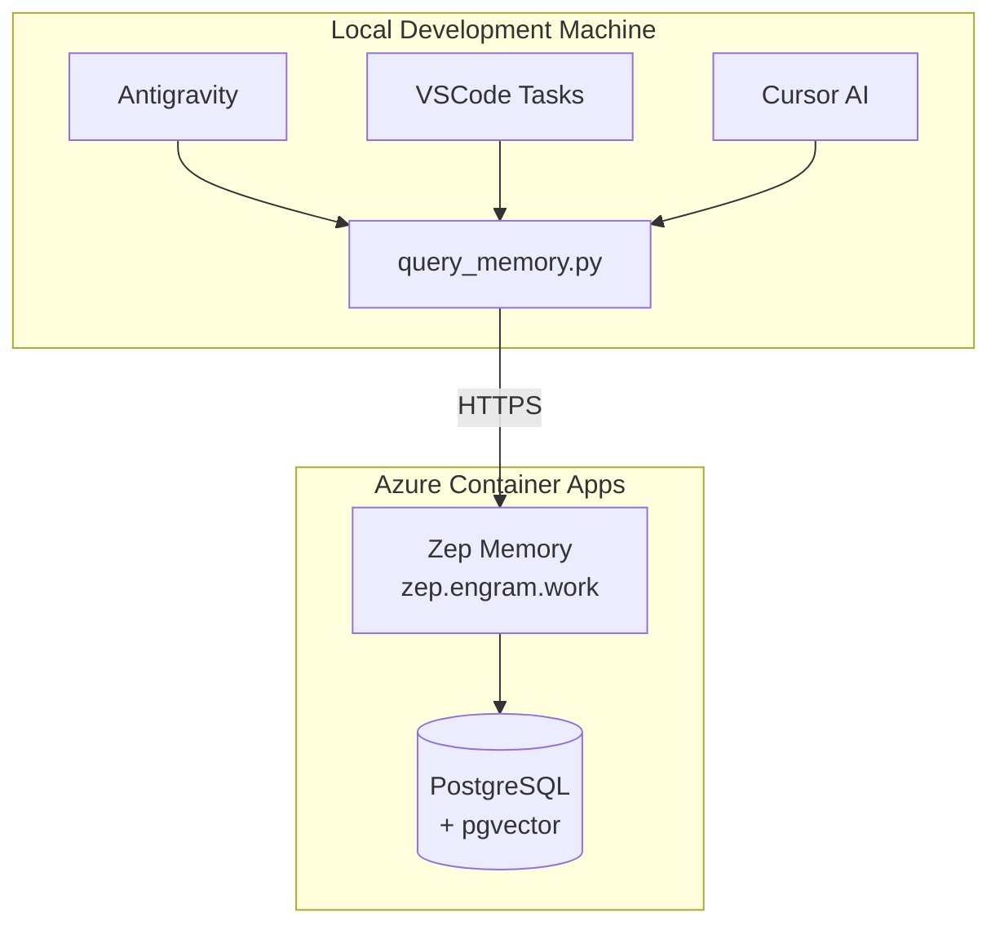

# Memory Query Interface

Enable AI coding agents (Antigravity, Cursor, VSCode Copilot) to query the Engram Knowledge Graph across any environment.

{: .highlight }
This capability allows any AI assistant to access the same contextual memory that powers Elena, making your entire project documentation, conversation history, and learned facts available during coding sessions.

## Quick Start

```bash
# Query Azure production memory
python -m backend.scripts.query_memory --env azure -q "voice live config"

# List recent episodes from Azure  
python -m backend.scripts.query_memory --env azure --episodes

# Get facts about a user
python -m backend.scripts.query_memory --env azure --facts -u "user-derek"
```

## Available Environments

| Environment | URL | Description |
|-------------|-----|-------------|
| `local` | <http://localhost:8000> | Local Zep (Docker) |
| `azure` | <https://zep.engram.work> | Azure Container Apps |
| `staging` | <https://zep-staging.engram.work> | Staging (if configured) |

```bash
# List all environments
python -m backend.scripts.query_memory --list-envs
```

## IDE Integration

### VSCode

The project includes pre-configured tasks. Open Command Palette (`Cmd+Shift+P`) and run:

- `Tasks: Run Task` → `Engram: Query Memory (Azure)`
- `Tasks: Run Task` → `Engram: List Episodes (Azure)`

These tasks prompt for input and display results in the terminal.

### Cursor

Cursor rules are automatically loaded from `.cursor/rules/memory-query.mdc`. The AI assistant will:

- Know how to query memory before asking you for context
- Use the correct environment for your setup
- Understand the response format

### Antigravity

Add this to your Antigravity system prompt:

```
Antigravity, you have direct access to the Engram Knowledge Graph.
To recall information, use: python -m backend.scripts.query_memory --env azure -q 'YOUR QUERY'
To check facts, use: python -m backend.scripts.query_memory --env azure --facts --user-id 'user-derek'  
To see recent episodes, use: python -m backend.scripts.query_memory --env azure --episodes
Always query memory before asking me for context that might already be documented.
```

## Command Reference

### Hybrid Search (Default Mode)

Combines keyword and semantic search:

```bash
python -m backend.scripts.query_memory --env azure -q "VoiceLive websocket timeout" -l 10
```

Options:

- `-q, --query` - Search text (required)
- `-l, --limit` - Max results (default: 5)
- `-u, --user-id` - Filter by user

### Episodes Mode

List conversation sessions:

```bash
python -m backend.scripts.query_memory --env azure --episodes -l 20
```

### Facts Mode

Get Knowledge Graph facts for a user:

```bash
python -m backend.scripts.query_memory --env azure --facts -u "user-derek"
```

## Architecture



## Security Considerations

{: .warning }
The current configuration has `auth: required: false` on Zep, which allows anonymous reads. For enterprise deployments, enable Zep authentication.

### Recommendations

1. **Enable Zep API Key** - Set `ZEP_API_KEY` in Azure Key Vault
2. **Network Restrictions** - Consider VNet integration for Zep
3. **Audit Logging** - Enable Application Insights for query tracking

## Troubleshooting

### Connection Failed

```bash
# Check Zep health
curl -s https://zep.engram.work/healthz
```

### No Results

- Verify documents are ingested in Azure Zep
- Try broader search terms
- Check episodes mode to see what data exists

### Import Errors

Ensure you're running from the project root with the virtual environment:

```bash
cd /path/to/engram
source .venv/bin/activate
python -m backend.scripts.query_memory --env azure --episodes
```

## Related

- [Agent Personas]()
- [Elena Agent]()
- [Memory Architecture]()
