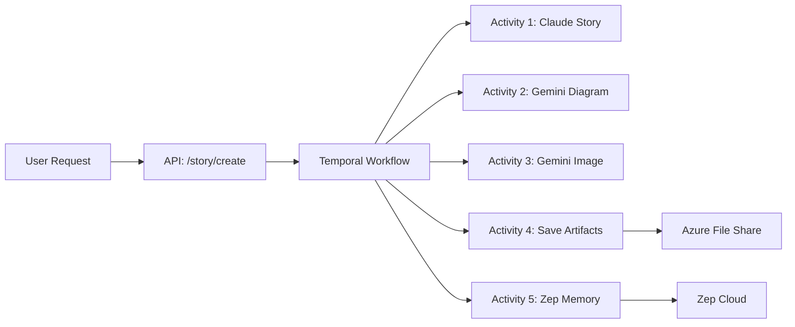

# Sage Story Generation SOP

> **Standard Operating Procedure for triggering Sage story and visual generation.**

## Overview

This document provides a clean, efficient path to generate a story and visual with Sage using the Azure-deployed Engram engine.

---

## Quick Reference (Single Command)

```bash
# From the engram repo root:
./scripts/api-call.sh POST /api/v1/story/create '{"topic":"Your Topic Here","include_diagram":true}'
```

**Prerequisites:**

- `az login` must be completed
- You must be authenticated to `derek@zimax.net` (or similar authorized account)

---

## Architecture



### Components

| Component | Technology | Purpose |
|-----------|------------|---------|
| **API Gateway** | FastAPI on Azure Container Apps | Receives requests, validates auth |
| **Workflow Engine** | Temporal | Orchestrates durable execution |
| **Story LLM** | Claude Sonnet 4 (Anthropic) | Generates narrative content |
| **Diagram/Image LLM** | Gemini 2.0 Flash / Imagen 3.0 | Generates specs and visuals |
| **Storage** | Azure File Share | Persists `.md`, `.json`, `.png` |
| **Memory** | Zep | Enriches knowledge graph |

---

## API Contract

### Endpoint

```
POST https://api.engram.work/api/v1/story/create
```

### Request Body

```json
{
  "topic": "string (required)",
  "context": "string (optional, background info)",
  "include_diagram": true,
  "diagram_type": "architecture"
}
```

### Response

```json
{
  "story_id": "20260105-162937-your-topic-slug",
  "topic": "Your Topic",
  "story_content": "# The Story...",
  "story_path": "docs/stories/20260105-162937-your-topic-slug.md",
  "diagram_spec": { ... },
  "diagram_path": "docs/diagrams/20260105-162937-your-topic-slug.json",
  "image_path": "/api/v1/images/20260105-162937-your-topic-slug.png",
  "created_at": "2026-01-05T16:29:37"
}
```

---

## Temporal Workflow Steps

The `StoryWorkflow` in `backend/workflows/story_workflow.py` executes 5 activities sequentially:

| Step | Activity | Timeout | Retries | Description |
|------|----------|---------|---------|-------------|
| 1 | `generate_story_activity` | 3 min | 3 | Claude generates story markdown |
| 2 | `generate_diagram_activity` | 2 min | 3 | Gemini generates diagram JSON spec |
| 3 | `generate_image_activity` | 2 min | 3 | Gemini generates visual (two-step: spec → image) |
| 4 | `save_artifacts_activity` | 30 sec | 3 | Writes to Azure File Share |
| 5 | `enrich_story_memory_activity` | 30 sec | 3 | Indexes content in Zep |

### Query Handlers

While a workflow is running, you can query its status:

| Query | Returns |
|-------|---------|
| `get_status()` | Current step name |
| `get_progress()` | 0-100 percentage |
| `get_story_preview()` | First 500 chars |

---

## Troubleshooting

### Image Path is `null`

If the story creates successfully but `image_path` is null, regenerate the visual:

```bash
./scripts/api-call.sh POST /api/v1/story/{story_id}/visual '{}'
```

### Temporal Connection Refused (Local)

Stories require Temporal. If running locally without Temporal:

- Start Temporal: `docker-compose up temporal`
- Or use the Azure environment (recommended)

### 401 Unauthorized

Re-authenticate:

```bash
az login
az account set --subscription "zimax sub"
```

---

## File Locations

| Artifact | Path Pattern |
|----------|--------------|
| Story | `docs/stories/{story_id}.md` |
| Diagram | `docs/diagrams/{story_id}.json` |
| Image | `docs/images/{story_id}.png` |
| API URL | `/api/v1/images/{story_id}.png` |

---

## Source Files

| File | Purpose |
|------|---------|
| [story.py](file:///Users/derek/Library/CloudStorage/OneDrive-zimaxnet/code/engram/backend/api/routers/story.py) | API router |
| [story_workflow.py](file:///Users/derek/Library/CloudStorage/OneDrive-zimaxnet/code/engram/backend/workflows/story_workflow.py) | Temporal workflow |
| [story_activities.py](file:///Users/derek/Library/CloudStorage/OneDrive-zimaxnet/code/engram/backend/workflows/story_activities.py) | Activity implementations |
| [claude_client.py](file:///Users/derek/Library/CloudStorage/OneDrive-zimaxnet/code/engram/backend/llm/claude_client.py) | Claude integration |
| [gemini_client.py](file:///Users/derek/Library/CloudStorage/OneDrive-zimaxnet/code/engram/backend/llm/gemini_client.py) | Gemini/Imagen integration |
