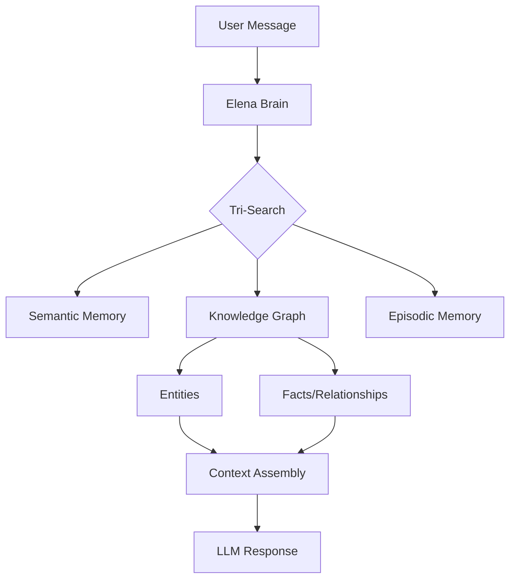

# AI Periodic Table Analysis

> **Mapping Engram's architecture to Martin Keen's AI Periodic Table and proposing the missing Gk (Graph Knowledge) element.**

## The AI Periodic Table

Martin Keen (IBM Master Inventor) released a framework organizing AI technologies into a structured periodic table format. The table uses two dimensions:

- **Rows (Maturity)**: Primitives → Compositions → Deployment → Emerging
- **Columns (Capability)**: Reactive → Retrieval → Orchestration → Validation → Models


---

## The Elements

| Row | C1 Reactive | C2 Retrieval | C3 Orchestration | C4 Validation | C5 Models |
|-----|-------------|--------------|------------------|---------------|-----------|
| **R1 Primitives** | **Pr** (Prompts) | **Em** (Embeddings) | — | — | **Lg** (LLM) |
| **R2 Compositions** | **Fc** (Function Call) | **Vx** (Vector) | **Rg** (RAG) | **Gr** (Guardrails) | **Mm** (Multimodal) |
| **R3 Deployment** | **Ag** (Agent) | **Ft** (Finetune) | **Fw** (Framework) | **Rt** (Red-team) | **Sm** (Small) |
| **R4 Emerging** | **Ma** (Multi-agent) | **Sy** (Synthetic) | **❓** | **In** (Interpret) | **Th** (Thinking) |

### The Missing Element

The cell at **Row 4 (Emerging) × Column 3 (Orchestration)** is empty.

---

## Proposal: Gk (Graph Knowledge)

We propose **Gk** as the missing element representing **Graph-based Knowledge Orchestration**.

### Definition

**Gk (Graph Knowledge)**: The use of temporal knowledge graphs to dynamically orchestrate agent reasoning, memory retrieval, and context assembly based on semantic relationships rather than static configurations.

### Rationale

| Aspect | Static Frameworks (Fw) | Graph Knowledge (Gk) |
|--------|------------------------|----------------------|
| **Routing Logic** | Predefined chains/DAGs | Dynamic, semantic routing |
| **Context Assembly** | Manual prompt engineering | Automatic via graph traversal |
| **Memory** | Stateless or session-scoped | Temporal, multi-session knowledge |
| **Discovery** | Explicit tool registration | Emergent via entity relationships |

### Why Emerging?

Graph Knowledge is positioned in the **Emerging** row because:

1. **Nascent tooling**: Zep, LangGraph, and similar tools are still maturing
2. **Requires infrastructure**: Needs vector DB + graph DB + temporal layer
3. **Paradigm shift**: Moves from "prompt engineering" to "context engineering"

---

## Engram Architecture Mapping

Engram implements elements across all five columns and all four rows:

| Element | Engram Component | Implementation |
|---------|------------------|----------------|
| **Pr** (Prompts) | System prompts | Agent personalities (Elena, Sage, Marcus) |
| **Em** (Embeddings) | Zep memory | Semantic search across episodes |
| **Lg** (LLM) | GeminiClient, ClaudeClient | Model abstraction layer |
| **Fc** (Function Call) | MCP Tools | 40+ tool definitions |
| **Vx** (Vector) | Zep vector store | Episode and fact retrieval |
| **Rg** (RAG) | Tri-Search | Memory → LLM augmentation |
| **Gr** (Guardrails) | Auth middleware | Enterprise security boundaries |
| **Mm** (Multimodal) | Imagen 3.0, VoiceLive | Image generation, voice I/O |
| **Ag** (Agent) | Elena, Marcus, Sage | Autonomous reasoning agents |
| **Ft** (Finetune) | — | Not yet implemented |
| **Fw** (Framework) | Temporal workflows | Durable orchestration |
| **Rt** (Red-team) | — | Not yet implemented |
| **Sm** (Small) | — | Could use Granite / Phi models |
| **Ma** (Multi-agent) | Agent delegation | Elena → Sage → Elena flows |
| **Sy** (Synthetic) | Story generation | Claude/Gemini content creation |
| **Gk** (Graph Knowledge) | **Zep Knowledge Graph** | Temporal entities + facts |
| **In** (Interpret) | — | Explainability not yet implemented |
| **Th** (Thinking) | Extended thinking | Chain-of-thought in workflows |

---

## Gk in Engram: The Implementation

Engram's **Zep integration** is a concrete implementation of Graph Knowledge:



### Key Capabilities

1. **Entity Extraction**: Automatic extraction of people, concepts, systems from conversations
2. **Fact Linking**: Relationships between entities stored as graph edges
3. **Temporal Awareness**: Facts have timestamps, enabling "as of" queries
4. **Cross-Session Learning**: Knowledge persists and compounds across sessions

---

## Formal Proposal

We formally propose adding **Gk (Graph Knowledge)** to the AI Periodic Table:

```
Symbol: Gk
Name: Graph Knowledge
Position: Row 4 (Emerging), Column 3 (Orchestration)
Definition: Temporal knowledge graphs for dynamic context orchestration
Examples: Zep, Neo4j + LLM, Microsoft GraphRAG
```

This element completes the **Emerging × Orchestration** cell and represents the next evolution beyond static frameworks—where orchestration is driven by *understanding* rather than *configuration*.

---

## References

- Martin Keen, IBM Master Inventor: [AI Periodic Table Explained](https://youtube.com)
- Zep: [Temporal Knowledge Graph for LLMs](https://www.getzep.com/)
- Microsoft: [GraphRAG Paper](https://arxiv.org/abs/2404.16130)
- Engram: This codebase
