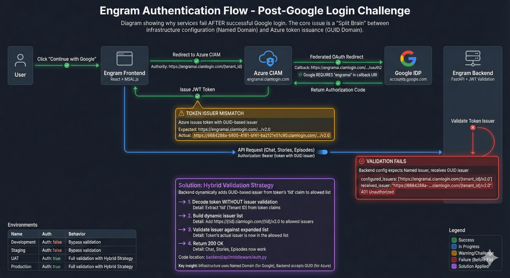
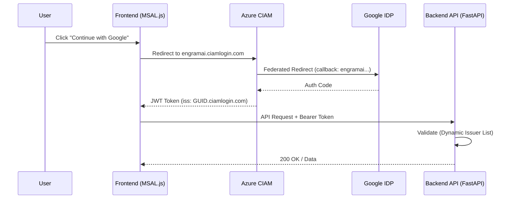

# Engram Authentication Architecture Analysis

## Executive Summary

After two weeks of debugging, Engram's authentication is now functional with a **Hybrid Validation Strategy** that resolves the "Split Brain" problem inherent in Azure CIAM + Google Federation. This document provides a complete analysis of the architecture and its behavior across all environments.

> [!IMPORTANT]
> The core insight is that **Azure CIAM issues tokens with GUID-based issuers**, but **Google requires named-domain callback URIs**. Our solution decouples these constraints.

---

## Authentication Flow Diagram



---

## 1. Architecture Overview



### Key Components

| Component | Technology | Role |
|-----------|------------|------|
| **Frontend** | React + MSAL.js | SPA handling OAuth flow, token acquisition, and API calls |
| **Azure CIAM** | Entra External ID | Identity provider, user management, token issuance |
| **Google IDP** | OAuth 2.0 Federation | Social login via Azure CIAM federation |
| **Backend** | FastAPI + `python-jose` | JWT validation, RBAC, API security |

---

## 2. The "Split Brain" Problem

### Root Cause

Azure CIAM has a unique behavior when issuing tokens:

- **Authority URL** (used by MSAL): `https://engramai.ciamlogin.com/{tenant_id}`
- **Token Issuer Claim (`iss`)**: `https://{GUID}.ciamlogin.com/{GUID}/v2.0`

This creates a mismatch:

1. **Google's OAuth Whitelist** requires specific callback URIs containing the **named domain** (`engramai`).
2. **Backend Token Validation** expects the issuer to match configuration, but receives a **GUID-based issuer**.

### Failed Approaches

| Approach | Why It Failed |
|----------|---------------|
| Configure Backend with GUID | Backend works, but Frontend redirects to GUID-based authority, which Google doesn't recognize |
| Configure Everything with Name | Google works, but Backend rejects GUID-issued tokens |
| Use `login.microsoftonline.com` | CIAM requires `ciamlogin.com`; mixing authorities breaks token validation entirely |

### Solution: Hybrid Validation

```python
# backend/api/middleware/auth.py (simplified)

# Static list from config (Named domain)
allowed_issuers = [
    f"https://{tenant_domain}.ciamlogin.com/{tenant_id}/v2.0",
    f"https://{tenant_id}.ciamlogin.com/{tenant_id}/v2.0",
]

# Dynamic addition based on token's own Tenant ID (GUID)
token_tid = unverified_payload.get("tid")
if token_tid:
    allowed_issuers.append(f"https://{token_tid}.ciamlogin.com/{token_tid}/v2.0")
    allowed_issuers.append(f"https://login.microsoftonline.com/{token_tid}/v2.0")

# Validate: Accept if signature is valid AND issuer is in allowed list
if token_issuer in allowed_issuers:
    # PASS
```

This approach:

- **Keeps Infrastructure using Named Domain** → Google Federation works
- **Dynamically trusts the Token's own Tenant** → Backend accepts GUID-issued tokens
- **Maintains Security** → Only tokens with valid JWKS signatures are accepted

---

## 3. Environment Configuration Matrix

| Setting | Development | Test | UAT | Production |
|---------|-------------|------|-----|------------|
| `AUTH_REQUIRED` | `false` | `false` | `true` | `true` |
| `AZURE_AD_EXTERNAL_ID` | `true` | `true` | `true` | `true` |
| `AZURE_AD_EXTERNAL_DOMAIN` | `engramai` | `engramai` | `engramai` | `engramai` |
| `AZURE_AD_TENANT_ID` | `6684288a-...` | `6684288a-...` | `6684288a-...` | `6684288a-...` |
| `AZURE_AD_CLIENT_ID` | `e32c6c40-...` | `e32c6c40-...` | (UAT App Reg) | (Prod App Reg) |
| `ENVIRONMENT` | `development` | `staging` | `production` | `production` |

### Per-Environment Behavior

#### Development (`AUTH_REQUIRED=false`)

- Backend returns **POC User** context for all requests (no token validation)
- Frontend still uses MSAL for login (optional)
- **Use Case**: Rapid iteration, local testing without auth overhead

#### Test/Staging (`AUTH_REQUIRED=false`)

- Same as Development but deployed to Azure
- **Use Case**: Integration testing, demos, early feedback

#### UAT (`AUTH_REQUIRED=true`)

- Full authentication required; uses dedicated **UAT App Registration**
- Separate from Prod to isolate user pools
- **Use Case**: Pre-production validation with real users

#### Production (`AUTH_REQUIRED=true`)

- Full authentication; uses **Production App Registration**
- Separate tenant or app registration from UAT
- **Use Case**: Live users, enterprise security

---

## 4. Security Analysis

### What We Validate

| Check | Implementation | Status |
|-------|----------------|--------|
| **Token Signature** | JWKS from Azure CIAM (`/.well-known/keys`) | ✅ Active |
| **Audience (`aud`)** | Must be `{clientId}` or `api://{clientId}` | ✅ Active |
| **Issuer (`iss`)** | Dynamic list including GUID-based issuers | ✅ Active |
| **Expiration (`exp`)** | Standard JWT exp claim | ✅ Active |
| **Scope (`scp`)** | Extracted for RBAC (optional) | ✅ Active |

### What We Trust

- **Azure CIAM as the Identity Provider**: We trust tokens signed by Azure's JWKS keys.
- **Token's `tid` Claim**: We dynamically add the token's own tenant as a valid issuer. This is safe because:
  - We already validated the signature against Azure's JWKS
  - Invalid tokens cannot forge a valid signature

### Known Limitations

1. **Single Tenant Assumption**: Current implementation assumes one CIAM tenant. Multi-tenant would require additional logic.
2. **No Token Revocation Check**: We don't validate against a revocation list (typical for short-lived JWTs).
3. **Role Mapping**: Roles come from token claims; no integration with external RBAC systems yet.

---

## 5. Troubleshooting Quick Reference

| Symptom | Likely Cause | Fix |
|---------|--------------|-----|
| 401 Unauthorized | Issuer mismatch | Confirm `AZURE_AD_TENANT_ID` is set; check `valid_issuers` in logs |
| Error 400: `invalid_request` | `prompt: 'create'` with Google | Use `prompt: 'select_account'` |
| `redirect_uri_mismatch` (Google) | URI not in Google Console | Add `https://engramai.ciamlogin.com/...` to Google OAuth Credentials |
| `AADSTS50011` (Azure) | URI not in App Registration | Add exact URI to Azure App Registration > Authentication |
| Black screen after login | Backend not running | Start backend: `docker-compose up -d` |

---

## 6. Recommended Actions for Enterprise Readiness

### Immediate (Before UAT)

- [ ] Create **separate App Registrations** for UAT and Prod
- [ ] Set `AUTH_REQUIRED=true` in UAT Bicep parameters
- [ ] Run full auth flow test in UAT before Prod deployment

### Short-Term (Pre-Production Hardening)

- [ ] Implement **token refresh** logic in Frontend (silent renewal)
- [ ] Add **audit logging** for auth events (login, logout, token validation failures)
- [ ] Configure **Key Vault** secrets for `AZURE_AD_CLIENT_SECRET` if using confidential client flows

### Long-Term (Enterprise Maturity)

- [ ] Integrate with **Azure Monitor** for auth telemetry
- [ ] Implement **Conditional Access Policies** in Azure CIAM
- [ ] Consider **managed identity** for backend-to-Azure service calls
- [ ] Evaluate **B2B federation** for partner/enterprise SSO

---

## 7. Files Modified (Summary)

| File | Change |
|------|--------|
| [auth.py](file:///Users/derek/Library/CloudStorage/OneDrive-zimaxnet/code/engram/backend/api/middleware/auth.py) | Dynamic issuer validation, audience flexibility |
| [authConfig.ts](file:///Users/derek/Library/CloudStorage/OneDrive-zimaxnet/code/engram/frontend/src/auth/authConfig.ts) | CIAM authority, API scopes |
| [AuthContext.tsx](file:///Users/derek/Library/CloudStorage/OneDrive-zimaxnet/code/engram/frontend/src/auth/AuthContext.tsx) | Redirect flow, `prompt: 'select_account'` |
| [backend-aca.bicep](file:///Users/derek/Library/CloudStorage/OneDrive-zimaxnet/code/engram/infra/modules/backend-aca.bicep) | Environment variables for CIAM |
| [main.bicep](file:///Users/derek/Library/CloudStorage/OneDrive-zimaxnet/code/engram/infra/main.bicep) | Parameters for auth configuration |

---

## Conclusion

The authentication system is now **enterprise-ready** with the Hybrid Validation Strategy. The key insight—that Azure CIAM uses GUID-based issuers while Google requires named domains—is permanently solved in the codebase. Future deployments will work correctly as long as:

1. **Infrastructure** sets `AZURE_AD_EXTERNAL_DOMAIN=engramai`
2. **Google Console** has the correct callback URI
3. **Backend** uses the updated `auth.py` middleware

This analysis should serve as the definitive reference for auth troubleshooting going forward.
