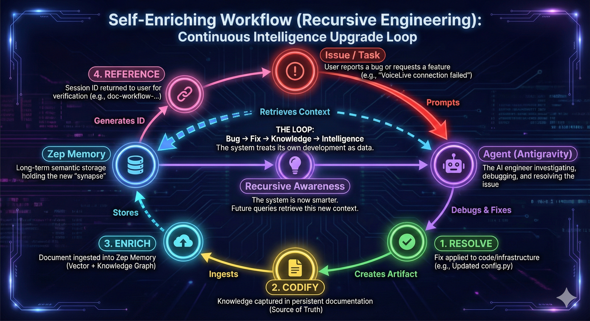

# The Self-Enriching Workflow: Recursive Engineering

> **"Don't just fix the code. Upgrade the brain."**

## The Paradigm Shift

Traditional software engineering is linear:

1. **Break** (Bug found)
2. **Fix** (Code updated)
3. **Forget** (Knowledge remains in the developer's head or lost in commit logs)

The **Engram Self-Enriching Workflow** introduces a recursive loop where every resolution permanently upgrades the system's intelligence. When the Agent fixes a problem, it doesn't just push code—it **ingests the solution into its own memory**.

## The Workflow: Fix → Document → Ingest

1. **Debug & Resolve:** The Agent identifies the root cause (e.g., "Azure Platform Auth breaks CORS") and applies a fix.
2. **Codify Knowledge:** The Agent creates a permanent "Source of Truth" document (e.g., `docs/architecture/concept-authentication.md`) capturing the *why* and *how*.
3. **Enrich Memory:** The Agent immediately **ingests** this document into Zep (the Long-Term Semantic Memory).
4. **Reference:** Provide the **Zep Session ID** (e.g., `doc-workflow-123`) as a permalink to the enriched memory.
5. **Recursive Awareness:** The Agent (and all other agents in the system like Elena or Marcus) is now *aware* of this architectural decision. Future queries about "CORS" or "Auth" will retrieve this new context, preventing regression loops.

## The "Prompt" Strategy

To activate this workflow, users should treat the Agent as a partner responsible for its own training.

### How to Trigger It

When requesting a fix, explicitly instruct the Agent to update its memory.

**The Golden Prompt:**
> "Fix this issue, document the solution, and **enrich memory** with the new knowledge."

### Example Interaction

**User:** "The VoiceLive connection isn't working."
**Agent:** (Debugs logs, finding a configuration mismatch)
**User:** "Okay, apply the fix."
**Agent:** (Updates `config.py` and `bicep`)
**User:** **"Great. Now enrich memory with this."**
**Agent:** (Creates `voice-live-configuration.md`, runs ingestion script, and confirms: *"Elena is now aware of the correct VoiceLive configuration."*)
**Agent:** *"Memory Reference: `doc-voice-live-configuration-ab12cd34`"*

## Benefits

1. **Deployment Immunity:** New features/fixes are typically lost when containers restart. Semantic Memory persists across deployments.
2. **Team Alignment:** Technical decisions are instantly available to all Agents (Business, Project, Dev).
3. **Rapid Onboarding:** A new Agent instance starts with the collective wisdom of all previous debugging sessions.
4. **Zero-Regression Culture:** The system doesn't just solve problems; it "learns" to avoid them.
